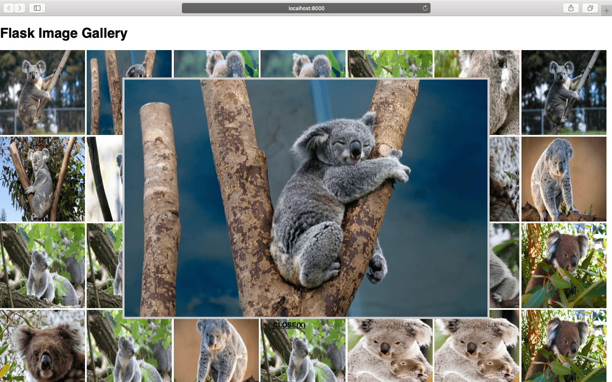

# Flask Image Gallery

A Flask application that lets you quickly publish and view a gallery of images from a filesystem.




It can be useful if you wish to quickly look at images on your server or your own local machine.

The application is "Simple by Design".

### Requirements
```
Flask==1.1.1
```
### Run application
```
python3 app.py /path/to/your/root/directory/containing/images
```

If you wish to run it on a server and view the gallery on your own system then you will need to [port forward](https://www.ssh.com/ssh/tunneling/example) to your local system's IP or you might use a tunnelling service like [ngrok](https://ngrok.com).
